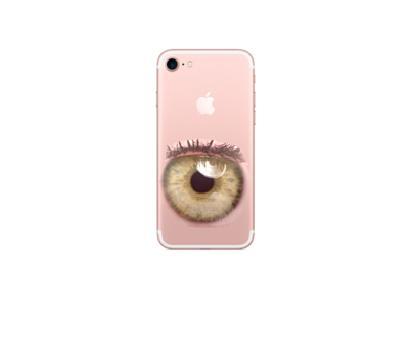

## Assignment 3
### Question 1. Toy Problem(20pts)

```matlab
%% TOY PROBLEM(20pts)

% Adding src path 
addpath('./src'); 

 disp('-----------------TOY-----------------');
 
 tic
 
 img = imread('./data/toy_problem.png');
 figure(), subplot(1,2,1), imshow(img);
 
 img2 = toy_example('./data/toy_problem.png');
 subplot(1,2,2), imshow(img2);
 fprintf('\n');
 
 toc
```
Following A3.pdf, function toy example code is written.

```matlab
function x = toy_example(img_file)

%%% Read image & convert to im2double
im = imread(img_file);
im = im2double(im);

%%%% maps each pixel to a variable number
[imh, imw, nn] = size(im);
im2var = zeros(imh, imw);
im2var(1:imh*imw) = 1:imh*imw; 

%%% Initialization
A = sparse((imh-1)*imw+(imw-1)*imh+1,imh*imw);
e=0;

for y = 1:imh
    for x = 1:imw-1
        e=e+1;
        A(e, im2var(y,x+1))=1;
        A(e, im2var(y,x))=-1;
        b(e) = im(y,x+1)-im(y,x);
    end
end

for x = 1:imw
    for y = 1:imh-1
        e=e+1;
        A(e, im2var(y+1,x))=1;
        A(e, im2var(y,x))=-1;
        b(e) = im(y+1,x)-im(y,x);
    end
end

e=e+1;
A(e, im2var(1,1))=1;
b(e)=im(1,1); 

%%% Reconstruct Image
% Least Square Covariance
v = lscov(A,b');

x = reshape(v,[size(im,1) size(im,2)]);
end
```
**Results**


### Question 2. POISSION BLENDING (50pts)
```matlab
%% POISSON BLENDING (50pts)

disp('----------POISSON BLENDING-----------');

tic

im_background = imresize(im2double(imread('./data/hiking.jpg')), 0.5, 'bilinear');
im_object = imresize(im2double(imread('./data/penguin-chick.jpeg')), 0.5, 'bilinear');
im2_object = imresize(im2double(imread('./data/penguin.jpg')), 0.5, 'bilinear');

% get source region mask from the user each
objmask = getMask(im_object);
objmask2 = getMask(im2_object);
% align im_s and mask_s with im_background & im_t
[im_s, mask_s, im_t] = alignSource(im_object, objmask, im_background);
[im_s2, mask_s2, im_t] = alignSource(im2_object, objmask2, im_t);

% blend
im_blend = poissonBlend(im_s, mask_s, im_background);
im2_blend = poissonBlend(im_s2, mask_s2, im_blend);
figure(5), hold off, imshow(im2_blend);

toc
```
However, It takes about 4200 seconds for ALL process because matlab code implements all image size..

**Results**

Naive Image


Poission Blending Image


### Question 3. BLEDNING WITH MIXED GRADIENTS (10pts)
```matlab
%% BLENDING WITH MIXED GRADIENTS (10pts)

disp('----------MIXED BLENDING-----------');

tic

im_background = imresize(im2double(imread('./data/hiking.jpg')), 0.5, 'bilinear');
im_object = imresize(im2double(imread('./data/penguin-chick.jpeg')), 0.5, 'bilinear');
im2_object = imresize(im2double(imread('./data/penguin.jpg')), 0.5, 'bilinear');

% get source region mask from the user each
objmask = getMask(im_object);
objmask2 = getMask(im2_object);
% align im_s and mask_s with im_background & im_t
[im_s, mask_s, im_t] = alignSource(im_object, objmask, im_background);
[im_s2, mask_s2, im_t] = alignSource(im2_object, objmask2, im_t);

% blend
im_blend = mixedBlend(im_s, mask_s, im_background);
im2_blend = mixedBlend(im_s2, mask_s2, im_blend);
figure(6), hold off, imshow(im2_blend);

toc
```


**Results**

Naive Image


Mixed Blending Image


### Question 4. MY OWN EXAMPLES (20pts)

**Results**

Naive Image


Poission Blending Image

 

Mixed Blending Image


Naive Image


Poission Blending Image

 

Mixed Blending Image



