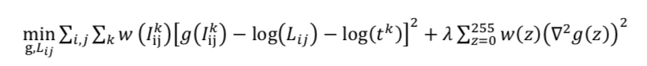
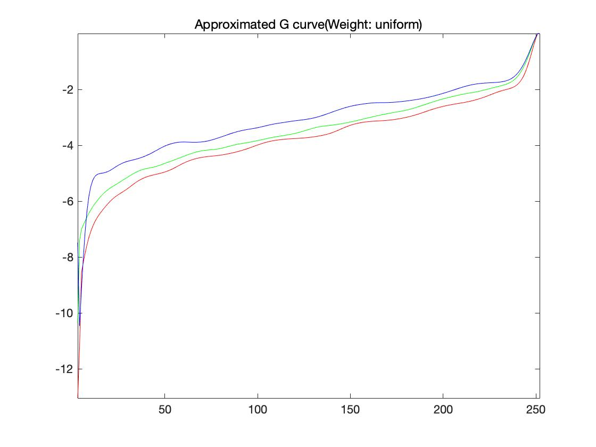
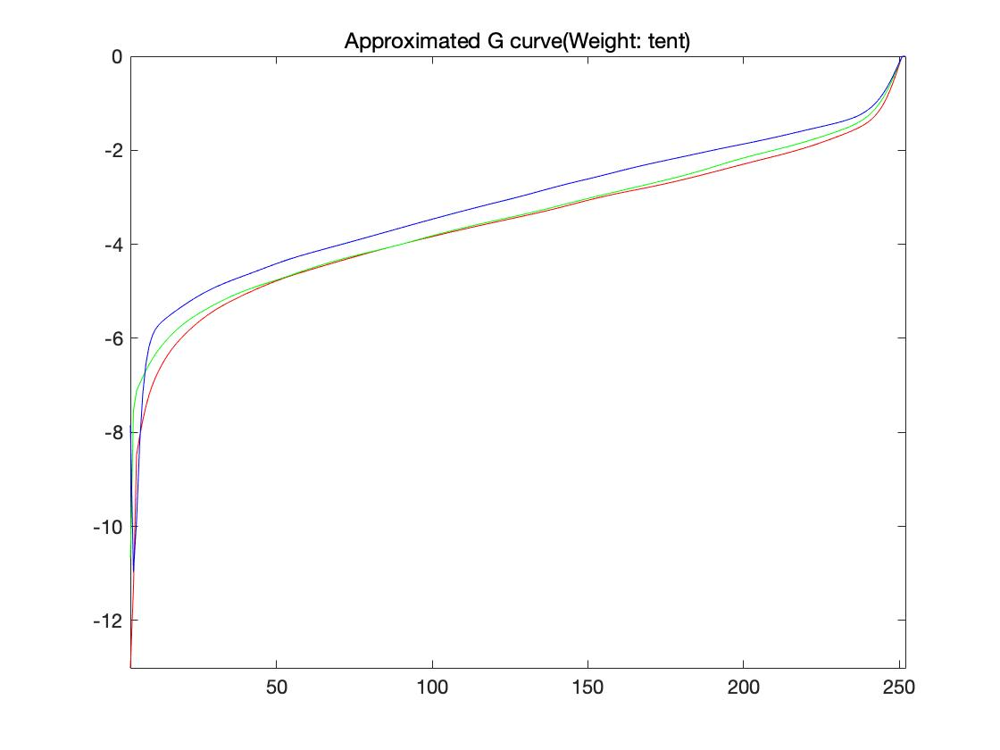
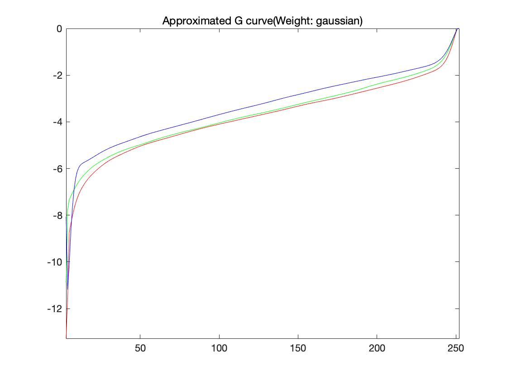

## Assignment 4
### Question 1. LINEARIZED RENDERED IMAGE (25pts)

This work is to linearize the rendered image which is non-linear. To achieve my goal , I have to solve least squares optimization problem.

I choose 'lambda = 1000' for strict smoothing and Result part shows each 'g' curve using uniform, tent, gaussian weight scheme for each color channels, respectively.

**Results**

### Question 2. MERGE EXPOSURE STACK INTO HDR IMAGE (15pts)

**Results**

### Question 3. EVALUATION (10pts)

**Results**

### Question 4. PHOTOGRAPHIC TONEMAPPING (20pts)

**Results**

### Question 5. TONEMAPPING USING BILITERAL FILTERING (30pts)

**Results**

