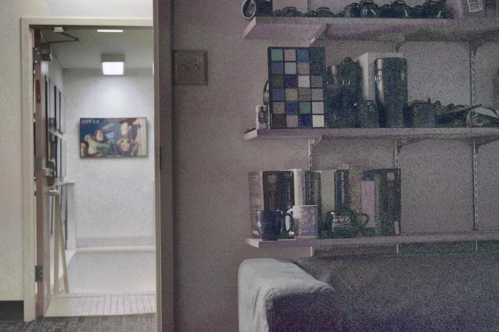
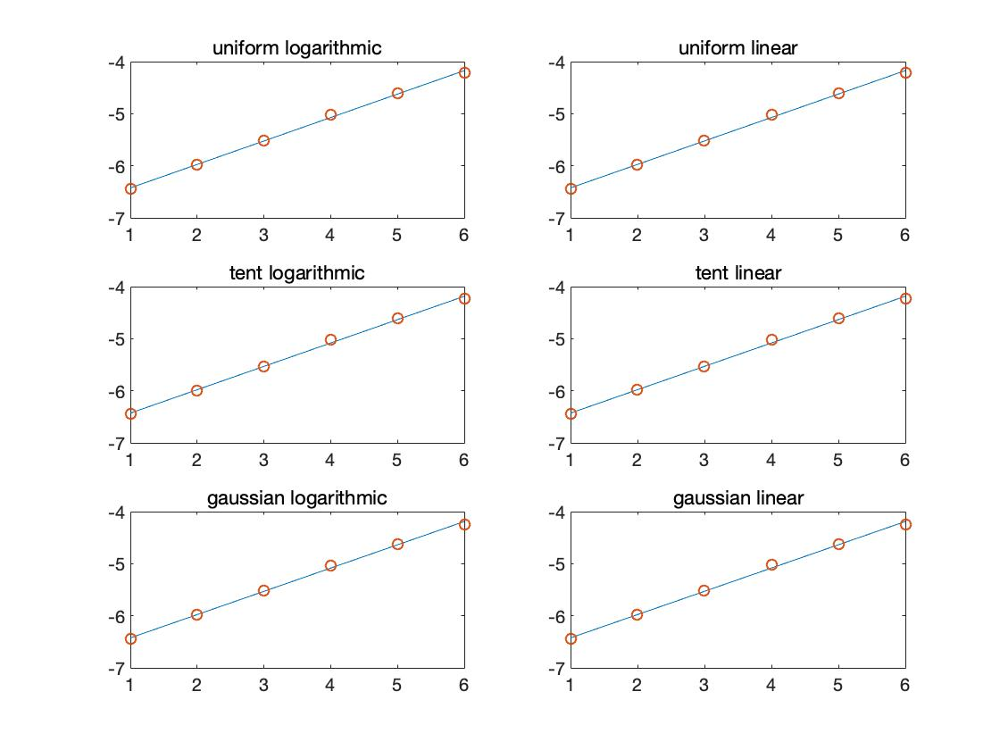

## Assignment 4

### Post-Processing : CONVERT .NEF FILE INTO .TIFF FILE

I convert '.nef file' into '.tiff file' by using dcraw.exe

### Question 1. LINEARIZED RENDERED IMAGE (25pts)

This work is to linearize the rendered image which is non-linear. To achieve my goal , I have to solve least squares optimization problem.


I choose 'lambda = 1000' for strict smoothing and Result part shows each 'g' curve using uniform, tent, gaussian weight scheme for each color channels, respectively. weighting type image which this project uses is shown below.


**Results**


As you see, 'g' curve using tent and gaussian is more smoother than uniform weighting type.

### Question 2. MERGE EXPOSURE STACK INTO HDR IMAGE (15pts)

I merge exposure stack into HDR IMAGE each with two 'file_type : Rendered, Raw', 'weight_type : uniform, tent, gaussian', 'merge_type : logarithmic, linear'. The image is shown below.

**Results**

**uniform, raw, linear**

**uniform, raw, logarithmic**

**uniform, rendered, linear**

**uniform, rendered, logarithmic**

**tent, raw, linear**

**tent, raw, logarithmic**

**tent, rendered, linear**

**tent, rendered, logarithmic**

**gaussian, raw, linear**

**gaussian, raw, logarithmic**

**gaussian, rendered, linear**

**gaussian, rendered, logarithmic**


As you see, in uniform weighting cases, Raw image is better thatn Rendered image. However, in weighting type tent and gaussian cases, especially, 'rendered image + logarithmic merge type' is much better than 'rendered image + linear merge type' in my view.

### Question 3. EVALUATION (10pts)

I use linear regression each types.

```matlab
UNIFORM = 1; TENT = 2; GAUSSIAN = 3;
LOGARITHMIC = 1; LINEAR = 2;
weight_type={'uniform', 'tent', 'gaussian'};
merge_type={'logarithmic', 'linear'};

image_stack = cell(3, 2);

position = [770 126  750 143;
            772 156  752 178;
            775 188  753 208;
            775 220  755 238;
            775 250  756 272;
            778 284  758 304];

for idx_weight=1:3
    for idx_merge=1:2
        matfile = load(sprintf('results/Q2_HDR/hdr_raw/%s_raw_%s.mat', weight_type{idx_weight}, merge_type{idx_merge}));
        im = matfile.im_hdr;
        
        im = rgb2xyz(im, 'ColorSpace', 'linear-rgb');
        image_stack{idx_weight, idx_merge} = im;
    end
end

intensity = zeros(3, 2, 6);

% Linear regression
e = 0;
figure;
for idx_weight=1:3
    for idx_merge=1:2
        e = e + 1;
        X = ones(6, 2);
        y = zeros(6, 1);
        for i=1:6
            intensity(idx_weight, idx_merge, i) = log(mean(mean(mean(image_stack{idx_weight, idx_merge}(position(i, 2):position(i, 4), position(i, 3):position(i, 1), 2)))));
 
            y(i, 1) = intensity(idx_weight, idx_merge, i);
            X(i, 2) = i;
        end
        % Linear regression solver
        b = X \ y;
        yCalc = X * b;
        
        Rsq = 1 - sum((y - yCalc).^2) / sum((y - mean(y)).^2);
        
        subplot(3, 2, e);
        plot(X(:, 2), yCalc);
        hold on;
        scatter(X(:, 2), y);
        hold off;
        title(sprintf('%s %s(Rsq: %.5f)', weight_type{idx_weight}, merge_type{idx_merge}, Rsq));
    end
end
```

**Results**



### Question 4. PHOTOGRAPHIC TONEMAPPING (20pts)

**Results**


### Question 5. TONEMAPPING USING BILITERAL FILTERING (30pts)

**Results**

