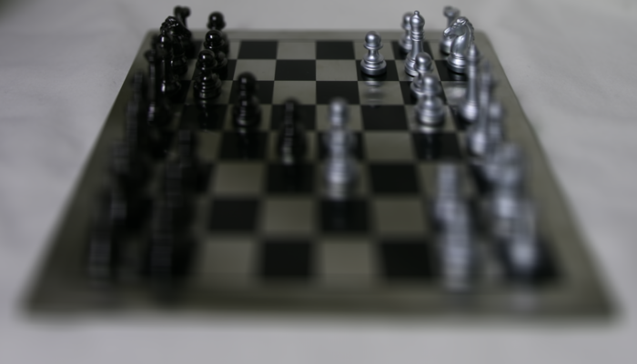

## Assignment 5

### Question 1. INITIALS (5pts) + Question 2. SUB-APERTURE VIEWS (20pts)

Given plenoptic camera image has 16 by 16 aperture domain source pixels. So, I set L = (16, 16, 400, 700, 3). Then, I put image to img_plenoptic pixel each by using 'for' matlab tool.

**Results**

**plenoptic image**

**mosaic image**

I captured image each because of its size is So... big!

### Question 3. REFOCUSING AND FOCAL-STACK GENERATION (40pts)

I implement refocusing which the assignment document explains by using formula as shown below. 
And, I set `d = 0`, `d = 0.6`, `d = 1`, `d = 1.6`, `d = 2`  

**Results**

**d = 0**

**d = 0.6**

**d = 1**

**d = 1.6**

**d = 2**

### Question 4. ALL-FOCUS IMAGE AND DEPTH FROM DEFOCUS (35pts)

**Results**

